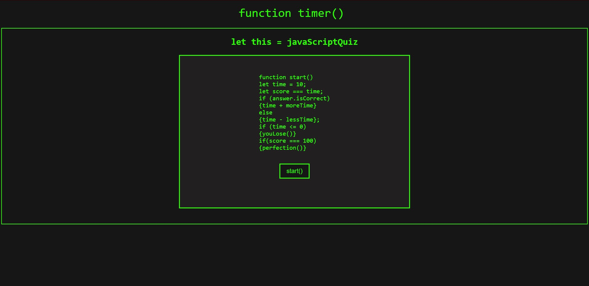

# JavaScript - Quiz

## Challenge 4: JavaScript Quiz

### Description: This JavaScript Quiz is designed to test your knowledge and speed.

    You will be given 10 seconds to answer the first question.

    If you get that question right, you will be given more time.

    If you get that question wrong, you will lose time.

    If you run out of time, you lose.

    Your score will equal your time.

    Try to get a perfect score of 100! (it is possible!)

GitHub Repo Link: https://github.com/EMK2473/javascript-quiz/

Deployed Link: https://emk2473.github.io/javascript-quiz/

